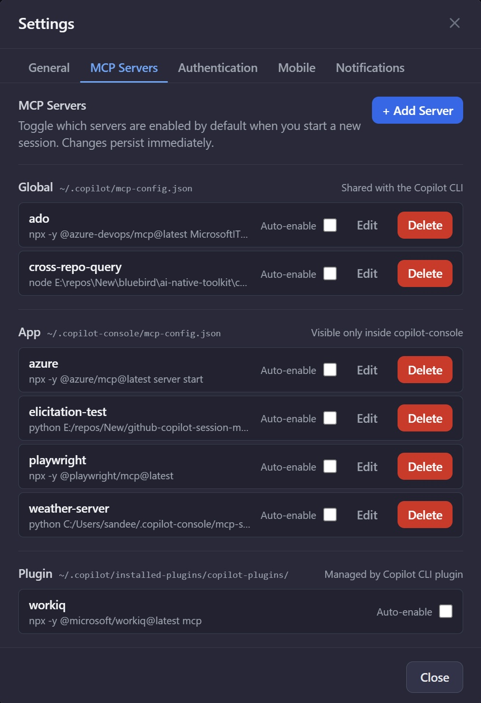

# MCP Servers

MCP servers provide external tools (e.g., GitHub, databases, internal APIs) that agents can call.

## Manage MCP Servers in Settings

The MCP Servers tab in **Settings** is the primary way to add, edit, enable, disable, and delete MCP servers — no need to hand-edit JSON config files.

**Add a server**
1. Open **Settings → MCP Servers** and click **Add server**.
2. Give it a name and paste the server's JSON config block (from the server's docs — typically the `command`, `args`, and any `env` it needs).
3. Choose the scope:
   - **App-only** — visible to Copilot Console only.
   - **Global** — shared with the Copilot CLI on this machine.
4. Save. The server appears in the list and can be enabled immediately.

**Edit / enable / disable / delete**
- Click any server row to open the editor and update its config.
- Use the toggle to enable or disable without removing it.
- Use the trash icon to delete (config is removed from the underlying file too).

## Per-session and per-agent overrides

The settings tab controls which servers *exist* and which are enabled by default. You can still narrow the selection per session or per agent:

- In the **Agent Editor**, pick the MCP servers a saved agent should bring with it.
- In **Session Settings** (or the in-chat **MCP Selector**), override the picks for a single session.

Keep MCP selections minimal — only enable what the session actually needs.

## Auto-enabled defaults

On first install, Copilot Console auto-enables a small set of broadly useful MCP servers so a new user has something to play with without configuring anything. You can disable any of them in **Settings → MCP Servers** at any time, and your choice persists across upgrades. Servers you add yourself are never auto-enabled — you stay in control of new additions.

## OAuth Authentication

MCP servers that require OAuth (e.g., GitHub MCP, hosted SaaS connectors) sign in directly from Copilot Console — no need to drop into a terminal.

**Sign-in flow**

1. Add or enable an OAuth-capable MCP server in the config.
2. Open the **MCP Selector** (in chat or Session Settings). Servers needing sign-in show a yellow status badge.
3. Click the server to start the OAuth flow. Your browser opens to the provider's consent page.
4. After approval, the badge turns green and the server's tools become available in the same session — no restart required.

**Per-server status badges**

Each MCP server in the selector shows a live status indicator:

- 🟢 **Connected** — server is up, tools are callable.
- 🟡 **Sign-in required** — OAuth token missing or expired. Click to (re)authenticate.
- 🔴 **Error** — server failed to start or returned an error. Hover for details.

**Auto-recovery on token expiry**

When an OAuth token expires mid-session, Copilot Console detects the failure, flips the badge to yellow, and shows a sticky banner. Click the badge (or the banner action) to re-sign-in without losing the session — the server reconnects and the next tool call goes through.

## Tool Builder Agent

Copilot Console ships with a built-in **Tool Builder** agent (`agents/tool-builder.json` in the seed) that scaffolds new Python custom tools for you — describe the tool you want and it writes the file into `~/.copilot-console/tools/`. See [Custom Tools](CUSTOM-TOOLS.md) for the full custom-tool guide.

## Storage / Advanced

For migration, scripted setup, or version control, the underlying JSON config files are still available:

- **Global (shared with Copilot CLI):** `C:\Users\<username>\.copilot\mcp-config.json`
- **App-only:** `C:\Users\<username>\.copilot-console\mcp-config.json`

Edits made in the Settings UI are written back to these files. You can hand-edit them too — Copilot Console picks up the changes the next time the MCP Servers tab is opened or a new session starts.

## Troubleshooting

- If a server doesn't show up, validate the JSON config and restart Copilot Console.
- If tools appear but calls fail, check the server's own logs and credentials.
- If an OAuth server is stuck on yellow, click it to retry sign-in. If the browser window doesn't open, check that pop-ups are allowed for `localhost`.

